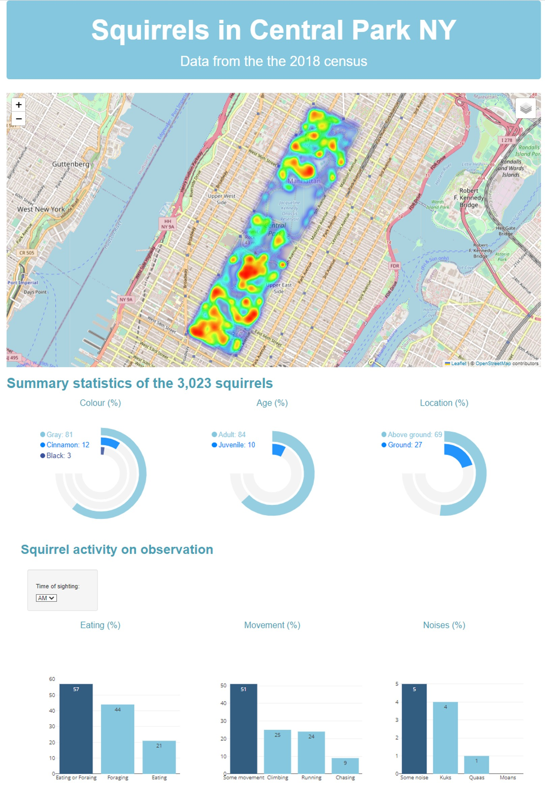

# Where are the squirrels in Central Park NYC?

### **Purpose**
 To understand the type of squirrels in Central Park, where they are located and their behaviour at time of observation.

 ### **Overview**
This was a full stack development, using data from a csv file, that was cleaned in python, then loaded into MongoDB.  MongoDB was connected to a flask app, with javascript referencing the data to display on the web page via html and css.  

The data used for this came from the 2018 Central Park Squirrel Census. 
https://data.cityofnewyork.us/Environment/2018-Central-Park-Squirrel-Census-Squirrel-Data/vfnx-vebw

 
### **Web page**
Below is an image of the created webpage.  The charts were designed to be interactive for users, you can:
- Select different layers on the heat map.
- Click on and off the bars on the radial charts
-  Select a time to display the data on squirrel activity

 

### **Report**
 - A written report can be found in the file called **Squirrels_NYC_report.pdf**

------------------------------------------------------------------------

### **Contact:**
Email: kymcoleman@gmail.com

------------------------------------------------------------------------
 

Folder structure

-The main folder contains:
- **squirrel_setup.ipynb** - code for setting the data up in mongodb and includes data cleaning
- **squirrel_analysis.ipynb** - code for the initial analysis undertaken to understand the data story
- **app.py** - code for the flask app which holds the data being used in the online dashboard
- **index.html** - html code for the online dashboard
- **Squirrels_NYC_report.pdf** - written report

-The folder called **static** contains:
- **css / style.css** - the style for the online dashboard
- **js / logic.js** - the js code for the online dashboard
- **js / leaflet-heat.js** - code required for the heatmaps used within the dashboard.
